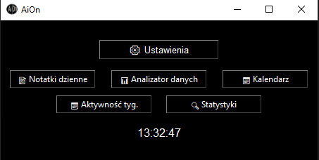

# 🧠 AiOn – Inteligentny Organizer Codzienności

> 📱 Projekt konkursowy stworzony przez uczniów technikum w ramach **Złota Apka**  
> 🎯 Lekki, darmowy, elegancki organizer z inteligentnymi funkcjami, który **pomaga planować dzień, analizować nawyki i być lepiej zorganizowanym**.

---

## 🖼️ Podgląd aplikacji



---

## 💡 Co to jest AiOn?

**AiOn** to minimalistyczna, ale zaawansowana aplikacja stworzona z myślą o uczniach, studentach i osobach, które chcą:

✅ szybciej planować dzień  
✅ analizować własne wpisy  
✅ nie zapominać o ważnych rzeczach  
✅ utrzymać regularność  
✅ i... lubią estetyczne narzędzia 🖤💚

---

## 🚀 Najważniejsze funkcje

| Funkcja                        | Opis                                                                 |
|-------------------------------|----------------------------------------------------------------------|
| 📝 Notatki dzienne            | Twórz szybkie wpisy każdego dnia. Własne myśli, zadania, pomysły     |
| 📊 Analizator danych          | Sortowanie, wyszukiwanie, podgląd oraz funkcja wykrywania zadań      |
| 📅 Kalendarz                  | Roczny kalendarz z możliwością edycji wydarzeń i przypomnieniami     |
| 📅 Aktywność tygodniowa       | Inteligentne podsumowanie regularności i aktywności w notatkach      |
| 🔍 Statystyki                 | Analiza: najczęstsze słowa, aktywne dni tygodnia, długość notatek    |
| ⚙ Ustawienia                  | Personalizacja interfejsu (kolory tła, tekstu, preferencje startowe) |
| 🧠 Przypomnienia              | Powiadomienia z kalendarza i notatek (np. "jutro", "ważne", "termin")|
| 💡 Sugestie AiOn              | Motywujące podpowiedzi oparte na Twojej aktywności                   |
| 🖼️ Interaktywny samouczek     | Przystępne wprowadzenie krok po kroku z grafikami                    |
| 🗂️ Działanie w tle            | Możliwość ukrycia do zasobnika systemowego bez wyłączania aplikacji  |

---

## ✨ Dlaczego warto?

- 🔬 **Wbudowana analiza treści** (słowa kluczowe, nawyki, regularność)
- 🔔 **Automatyczne przypomnienia** na podstawie treści i dat
- 🎨 **Estetyczny interfejs z personalizacją**
- 🚀 **Szybki start, pełna funkcjonalność offline**
- 🧠 **Efekt WOW dla użytkownika już od pierwszego uruchomienia**

---

## 👨‍💻 Autorzy

**Dorian Markowski**  
**Michał Biniakowski**  
Klasa **2J**, Technikum Elektroniczne nr 7 im. Wojska Polskiego w Bydgoszczy  
🔗 [https://zse.bydgoszcz.pl/](https://zse.bydgoszcz.pl/)

---

## 🛠️ Wymagania techniczne

ℹ️ Uwaga: po pierwszym uruchomieniu aplikacja stworzy swoje własne foldery i konfiguracje (np. `calendar/`, `notes/`, `aion_config.json`) automatycznie.


- Python **3.11+**
- Pakiety (instalacja jednym poleceniem):

```bash
pip install -r requirements.txt