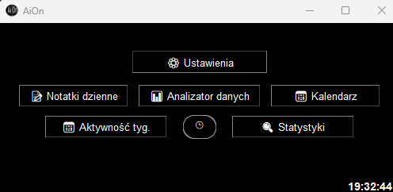

# 🧠 AiOn – Inteligentny Organizer Codzienności

> 📱 Projekt konkursowy stworzony przez uczniów technikum w ramach **Złota Apka**  
> 🎯 Nowoczesny organizer produktywności z inteligentną analizą notatek, kalendarzem, przypomnieniami i pełną personalizacją interfejsu.


---

## 🖼️ Podgląd aplikacji



---

## 💡 Co to jest AiOn?

**AiOn** to lekka, estetyczna i inteligentna aplikacja desktopowa stworzona z myślą o uczniach, studentach oraz osobach chcących lepiej organizować codzienność.

Aplikacja działa całkowicie offline i oferuje funkcje pomagające:

✅ planować dzień  
✅ tworzyć notatki i wydarzenia  
✅ analizować własne nawyki  
✅ otrzymywać inteligentne przypomnienia  
✅ utrzymywać regularność  
✅ zwiększać produktywność  
✅ personalizować wygląd aplikacji

---

# 🚀 Najważniejsze funkcje

| Funkcja                         | Opis                                                                 |
|--------------------------------|----------------------------------------------------------------------|
| 📝 Notatki dzienne             | Twórz szybkie wpisy każdego dnia – zadania, pomysły, przemyślenia    |
| 📊 Analizator danych           | Sortowanie, analiza i wykrywanie ważnych zadań w notatkach           |
| 📅 Kalendarz                   | Interaktywny kalendarz z możliwością zapisu wydarzeń                 |
| 📅 Aktywność tygodniowa        | Inteligentne podsumowanie regularności i aktywności                  |
| 🔍 Statystyki                  | Analiza słów, długości notatek oraz aktywnych dni                    |
| ⏱️ Stoper                      | Wbudowany stoper pomagający w skupieniu i produktywności             |
| ⏰ Alarm                        | System alarmów działający w tle                                      |
| 🔤 Personalizacja czcionek     | Zmiana czcionki i jej rozmiaru w całej aplikacji                     |
| 🎨 Personalizacja wyglądu      | Własne kolory tła i tekstu                                           |
| 🧠 Inteligentne przypomnienia  | Wykrywanie ważnych słów typu „jutro”, „termin”, „spotkanie”          |
| 💡 Sugestie AiOn               | Kontekstowe podpowiedzi i motywujące sugestie                        |
| 📘 Interaktywny samouczek      | Przystępne wprowadzenie do aplikacji krok po kroku                   |
| 🗂️ Działanie w tle             | Minimalizacja do zasobnika systemowego                               |
| ⚡ Optymalizacja działania      | Usprawniona wydajność i szybsze działanie aplikacji                  |
| 📦 Samodzielny plik `.exe`     | Możliwość uruchomienia aplikacji bez instalowania Pythona            |

---

## ✨ Dlaczego warto?

- 🔬 **Wbudowana analiza treści i nawyków**
- 🔔 **Automatyczne przypomnienia na podstawie treści**
- 🎨 **Nowoczesny interfejs z personalizacją**
- 🔤 **Możliwość zmiany czcionek i rozmiarów**
- ⏱️ **Wbudowane narzędzia produktywności**
- 🚀 **Szybkie i lekkie działanie**
- 💾 **Automatyczne zapisywanie konfiguracji**
- 🖥️ **Możliwość działania jako aplikacja .exe**
- 📦 **Wystarczy pobrać jeden plik `.exe` — bez instalacji dodatkowych folderów**
- 🧠 **Automatyczne tworzenie danych użytkownika w AppData**
- 🌐 **Pełne działanie offline**
- 🧠 **Efekt WOW już od pierwszego uruchomienia**

---

## 🧩 Technologie

AiOn został stworzony przy użyciu:

- Python 3
- Tkinter
- CustomTkinter
- Pillow
- Plyer
- Pystray
- JSON Config System
- PyInstaller

---

## 📦 Wersja wykonywalna

AiOn może zostać uruchomiony jako samodzielna aplikacja `.exe`
bez konieczności instalowania Pythona lub dodatkowych bibliotek.

### ✅ Jak działa wersja `.exe`?

- użytkownik pobiera tylko jeden plik `AiOn.exe`
- aplikacja działa od razu po uruchomieniu
- wszystkie zasoby (grafiki, tutorial, ikony, czcionki) są wbudowane w aplikację
- konfiguracja i dane użytkownika są automatycznie zapisywane w:

```plaintext
AppData/Roaming/AiOn/